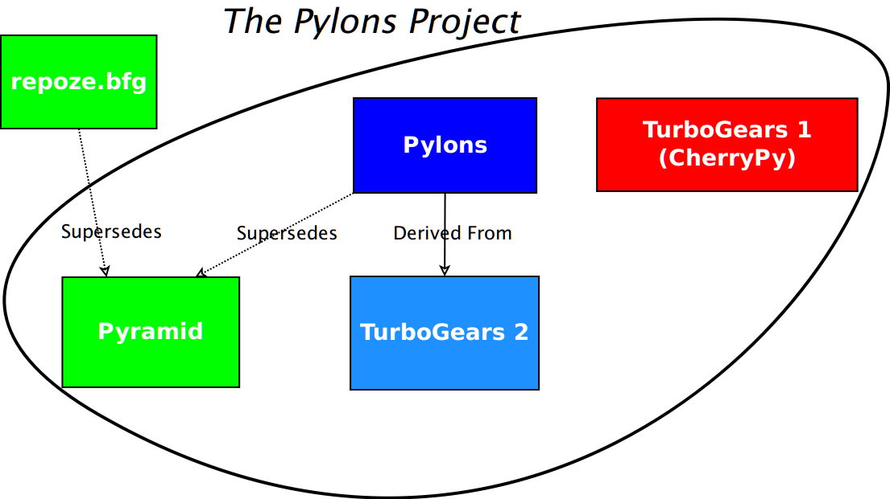

.. include:: <s5defs.txt>

PyCon 2011: State of Pylons, Turbogears, and repoze.bfg
=======================================================

:Authors:  Chris McDonough, Ben Bangert, Mark Ramm
:Date: 3/11/2011

Pylons
------

Pylons Web Framework

Pylons
------

- First released in 2006.

- Latest release of Pylons: 1.0.

- Since May 5, 2010, about 23K downloads.

- ~2400 members of the pylons-discuss maillist as of Mar 5 2011.

- ~60 PyPI packages which depend on Pylons

``repoze.bfg``
--------------

``repoze.bfg``
--------------

- Web framework inspired by Pylons, Django and Zope.

- First released in July 2008.

- Developed as a replacement for Zope 2.

- The latest release of BFG is also its final major release.

``repoze.bfg``
--------------

- Since last November, fewer than 1400 downloads (weak takeup).

- ~ 200 members of the ``repoze-dev`` maillist today.

- ~ 28 PyPI packages which depend on repoze.bfg

- Most users of ``repoze.bfg`` are ex-Zope users.

``repoze.bfg``
--------------

- 100% statement coverage via unit tests.

- 100% feature documentation.

- Extensible configuration system.

- ~ 80 committers.

Pyramid
-------

October 2010, ``repoze.bfg`` was forked to become Pyramid, a Pylons Project
subproject.

.. image:: pyramid-positive-80.png
   :align: center

Sample Application
-------------------

.. sourcecode:: python

   # imports elided
   @view_config(route_name='home')
   def hello_world(request):
       return Response('Hello world!')

   if __name__ == '__main__':
       config = Configurator()
       config.add_route('home', '/')
       config.scan()
       app = config.make_wsgi_app()
       serve(app, host='0.0.0.0')

Pyramid
-------

- ``repoze.bfg`` plus Mako templating, built-in sessioning,
  better URL dispatch features, and better imperative configuration
  extensibility (no ZCML).

- Latest release of Pyramid: 1.0 on January 31, 2011.

- Since January 31, 2011, ~5000 downloads (stronger takeup).

- ~34 PyPI packages which depend on Pyramid as of today.

Pyramid Features
----------------

- Map URLs to code.

- Authentication and authorization.

- Internationalization.

- Single-file apps or apps as packages.

- PasteDeploy integration (familiar to Pylons people).

- Easy unit, integration, functional testing.

- WSGI deployment.

- Comprehensive docs.

Pyramid Features (more)
-----------------------

- Chameleon and Mako templating out of the box; Jinja2 as an add-on.
  Multiple templating systems can be used at the same time.

- Easy "REST API" creation and JSON rendering.

- Runs on CPython 2.4+, GAE, Jython, and PyPy (no Python 3 support yet).

- Extensible configuration ("plugins", reuse an application without forking
  it).

- Static asset features.

Pyramid Features (more)
-------------------------

- Sessioning, flash messaging, CSRF protection.

- Event system.

- Exception views.

- WSGI middleware-provided exception debugging (WebError) and profiling
  (repoze.profile).

- Fast.

- 100% statement coverage via unit tests.

Pyramid Non-Features
--------------------

- Not a "full-stack" framework; persistence-system agnostic, no admin
  interface.

- Not a "microframework".  Has ~ 16 distribution dependencies.
  Microframework-like single-file apps possible though.

- Somewhere in the middle; provides useful "rails" but avoids "boxes".

Paster Templates
-----------------

- Pyramid itself has very few opinions.

- Paster templates have lots of opinions.

- Templates use (and disuse) specific Pyramid features and provide
  integrations with specific persistence systems (SQLAlchemy, ZODB, MongoDB,
  etc).

Technologies
------------

- WebOb

- Paste

- ``zope.component``

- Chameleon

- Mako

- Venusian (scanning library)

Not Zope
--------

- Pyramid != Zope.  Uses ``zope.component`` as a library, but it is not an
  application-developer visible feature.

- Steals some features from Zope though (traversal, declarative
  authorization).

Not Pylons
----------

- Pyramid shares no DNA with Pylons.

- But supports many Pylons-esque features.

- Similar, but not identical routing syntax.

- Plugpoints implemented via composition rather than subclassing.

- Has an analogue of Pylons-style "controllers" called "handlers".

"MVC"
-----

- Labels.

- To me, it's not MVC.  To you, it might be.

Pyramid Add-Ons
---------------

* ``pyramid_beaker``: Beaker session backend plug-in.

* ``pyramid_handlers``: analogue of Pylons-style "controllers" for Pyramid.

* ``pyramid_jinja2``: Jinja2 template renderer for Pyramid

* ``pyramid_mailer``: a package for sending emails.

Pyramid Add-Ons (more)
----------------------

* ``pyramid_rpc``: RPC service add-on for Pyramid.

* ``pyramid_who``: Authentication policy for pyramid using repoze.who 2.0
  API.

* ``pyramid_xmlrpc``: XML-RPC add-on for Pyramid

* ``akhet``: (in progress): Pylons-style development for Pyramid.

Pylons Project
--------------

- Merger of the Pylons and ``repoze.bfg`` communities.  Hoping to bring some
  TurboGears folks aboard in 2011.

- Pylons 1.x web framework shifted into “legacy” status.  Maintained
  indefinitely.

Pylons Project Members
----------------------

- Pylons-the-web-framework.

- Pyramid and its add-ons.

- TurboGears 1 and 2.

- Various libraries.

Pylons Project Visual
---------------------

BFG to Pyramid
--------------

- Almost unanimous support from community members wrt to switch to Pyramid
  branding.

- Almost total conversion of BFG community into Pylons community.

- BFG 1.3 will be the last release: superseded by Pyramid.

- Pyramid is mostly backwards compatible with ``repoze.bfg`` via the use of
  automated conversion via the ``bfg2pyramid`` script.

BFG Community Quotes
--------------------

`"Congrats! Great to see synergy, particularly amongst Python web
frameworks!"`

`"HOORAY!!!!!"`

`"This just totally made my day! Way to go guys."`

BFG Community Quotes
--------------------

`"Can I just say this is an almost unheard of degree of maturity and
pragmatism for a framework author to display. I'm very impressed, and this is
surely a good thing. Congratulations. :)"`

Not Built by Aliens
-------------------

We deny it all.

.. raw:: html

   

   <object width="853" height="510"><param name="movie" value="http://www.youtube.com/v/oKFBWzeHYS4?fs=1&amp;hl=en_US"></param><param name="allowFullScreen" value="true"></param><param name="allowscriptaccess" value="always"></param><embed src="http://www.youtube.com/v/oKFBWzeHYS4?fs=1&amp;hl=en_US" type="application/x-shockwave-flash" allowscriptaccess="always" allowfullscreen="true" width="853" height="510"></embed></object>

    

Sprints
-------

- Port WebOb to Python 3.

- Discuss WebOb/Werkzeug collaboration with Flask folks.

Futures
-------

- Pyramid 2 will be Python 3 compatible.

- Higher-level frameworks built on top of the Pyramid codebase.

