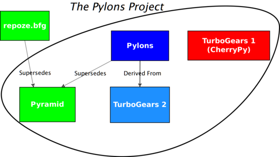

.. include:: <s5defs.txt>

Plone Conference 2011: Introduction to Pyramid
==============================================

:Authors:  Chris McDonough
:Date: 11/3/2011

Pylons
------

Pylons Web Framework

Pylons
------

- First released in 2006.

- Latest release of Pylons: 1.0.

- About 150K downloads over its lifetime til now.

- ~2600 members of the pylons-discuss maillist.

- ~60 PyPI packages which depend on Pylons

TurboGears
----------

- The TurboGears community decided to join the Pylons Project.

.. image:: TgGear.png
   :align: center

TurboGears
----------

- TurboGears 2 and Pylons are going to be maintained together

- Not as much collaboration as we'd like.

- Essentially not yet working together.

``repoze.bfg``
--------------

``repoze.bfg``
--------------

- Web framework inspired by Pylons, Django and Zope.

- First released in July 2008.

- Developed as a replacement for Zope 2.

- "Repoze" tagline: "Plumbing Zope 2 into the WSGI Pipeline".

- BFG has seen its final release (1.3).

- Other ``repoze``-branded software survives (``repoze.who``,
  ``repoze.profile``, et. al.).

``repoze.bfg``
--------------

- Fewer than 20K downloads in total (weak takeup).

- ~ 200 members of the ``repoze-dev`` maillist today.

- ~ 28 PyPI packages which depend on repoze.bfg

- Many users of ``repoze.bfg`` were ex-Zope users.

``repoze.bfg``
--------------

- Good docs, good test regime.

- Extensible configuration system.

- ~ 80 committers.

Pylons Project
--------------

.. class:: center

Web frameworks are hard.  Let's :huge:`COLLABORATE!`.

Pylons Project
--------------

- Project lead consolidation decision.

- Attempt to get Pylons, TurboGears and ``repoze.bfg`` communities rowing in
  the same direction.

- Pylons 1.x web framework shifted into “legacy” status.  Maintained
  indefinitely.

- TurboGears 1 and 2 maintained indefinitely.

- Most new development: Pyramid.

Pylons Project
--------------

Pyramid
-------

October 2010, ``repoze.bfg`` was renamed to Pyramid.

Pyramid
-------

- Pyramid is ``repoze.bfg`` plus features attractive to existing Pylons
  users: alternative templating language, built-in sessioning, better URL
  dispatch features, and better imperative configuration extensibility (no
  ZCML).

- Latest release of Pyramid: 1.2.1 on January 31, 2011.

- Since January 31, 2011, ~63K downloads (stronger takeup).

- ~60 PyPI packages which depend on Pyramid as of today.

Sample Application
-------------------

.. sourcecode:: python

   # imports elided
   @view_config(route_name='home')
   def hello_world(request):
       return Response('Hello world!')

   if __name__ == '__main__':
       config = Configurator()
       config.add_route('home', '/')
       config.scan()
       app = config.make_wsgi_app()
       serve(app, host='0.0.0.0')

Pyramid Features
----------------

- Map URLs to code.

- Authentication and authorization.

- Internationalization.

- Single-file apps or apps as packages.

- PasteDeploy integration (familiar to Pylons people).

- Easy unit, integration, functional testing.

Pyramid Features
----------------

- Chameleon and Mako templating out of the box; Jinja2 as an add-on.
  Multiple templating systems can be used at the same time.

- Easy "REST API" creation and JSON rendering.

- Runs on CPython 2.5+, GAE, Jython, and PyPy.

- Next release (1.3) will drop Python 2.5 compatibility in exchange for
  Python 3 compatibility.

- Windows and UNIX.

Pyramid Features
----------------

- Extensible configuration ("plugins", reuse an application without forking
  it).

- WSGI deployment.

- Comprehensive docs.

- 100% statement coverage via unit tests.

Pyramid Features
----------------

- Static asset features.

- Sessioning, flash messaging, CSRF protection.

- Event system.

- Exception views.

- Application debugging and profiling (``pyramid_debugtoolbar``).

- Fast.

Pyramid Non-Features
--------------------

- Not a "full-stack" framework; persistence-system agnostic, no admin
  interface.

- Not a "microframework".  Has ~ 12 distribution dependencies.
  Microframework-like single-file apps possible though.

- Somewhere in the middle; provides useful "rails" but avoids "boxes".

Paster Templates
-----------------

- Pyramid itself has very few opinions.

- Paster templates have lots of opinions.

- Templates use (and disuse) specific Pyramid features and provide
  integrations with specific persistence systems (SQLAlchemy, ZODB, MongoDB,
  etc).

Technologies
------------

- WebOb

- Paste

- ``zope.interface``

- Chameleon

- Mako

- Venusian (scanning library)

Not Zope
--------

- Pyramid != Zope.  Uses ``zope.interface`` as a library, but it is not an
  application-developer visible feature.

- Steals some concepts from Zope though (traversal, declarative
  authorization).

Not Pylons
----------

- Pyramid shares no DNA with Pylons.

- But supports many Pylons-esque features.

- Similar, but not identical routing syntax.

- Plugpoints implemented via composition rather than subclassing.

- Has an analogue of Pylons-style "controllers" called "handlers".

"MVC"
-----

- Labels.

- To me, it's not MVC.  To you, it might be.

Pyramid Add-Ons
---------------

* ``pyramid_beaker``: Beaker session backend plug-in.

* ``pyramid_handlers``: analogue of Pylons-style "controllers" for Pyramid.

* ``pyramid_jinja2``: Jinja2 template renderer for Pyramid

* ``pyramid_mailer``: a package for sending emails.

Pyramid Add-Ons (more)
----------------------

* ``pyramid_rpc``: RPC service add-on for Pyramid.

* ``pyramid_who``: Authentication policy for pyramid using repoze.who 2.0
  API.

* ``pyramid_rpc``: XML-RPC / JSONRPC add-on for Pyramid

* ``akhet``: Pylons-style development for Pyramid.

* ``apex``: Authentication-centered development environment for Pyramid.

* ``ptah``: Nascent development environment for Pyramid.

BFG to Pyramid
--------------

- Almost unanimous support from community members wrt to switch to Pyramid
  branding.

- Almost total conversion of BFG community into Pylons community.

- BFG 1.3 will be the last release: superseded by Pyramid.

- Pyramid is mostly backwards compatible with ``repoze.bfg`` via the use of
  automated conversion via the ``bfg2pyramid`` script.

Sprints
-------

- See https://github.com/Pylons/pyramid/wiki/Sprint-Ideas

Futures
-------

- 1.3 due before end of year (focus: Python 3).

- Higher-level frameworks built on top of the Pyramid codebase.

